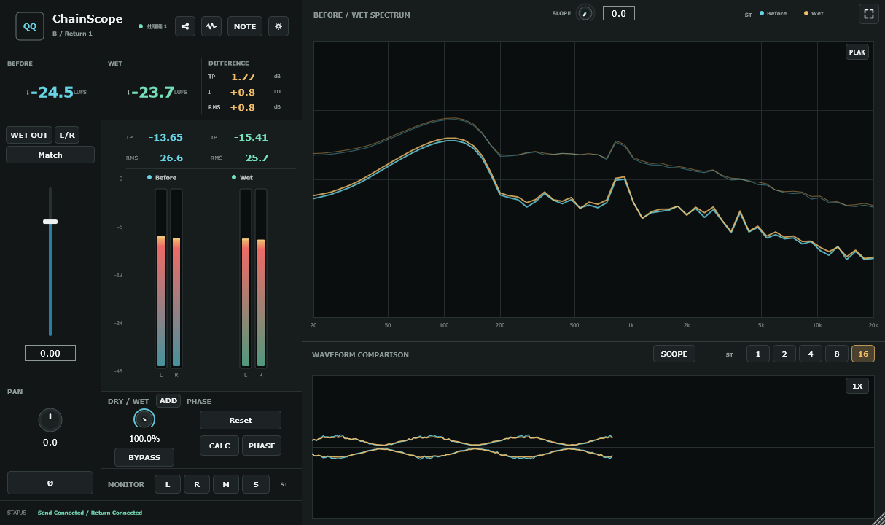
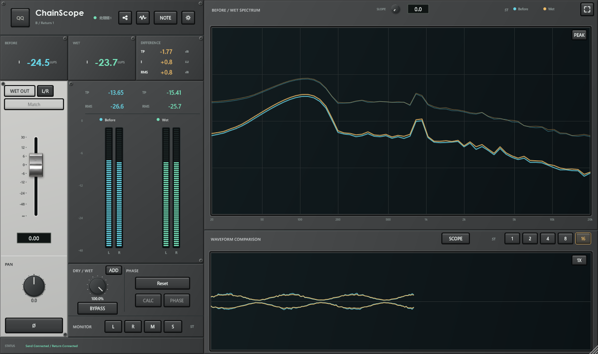
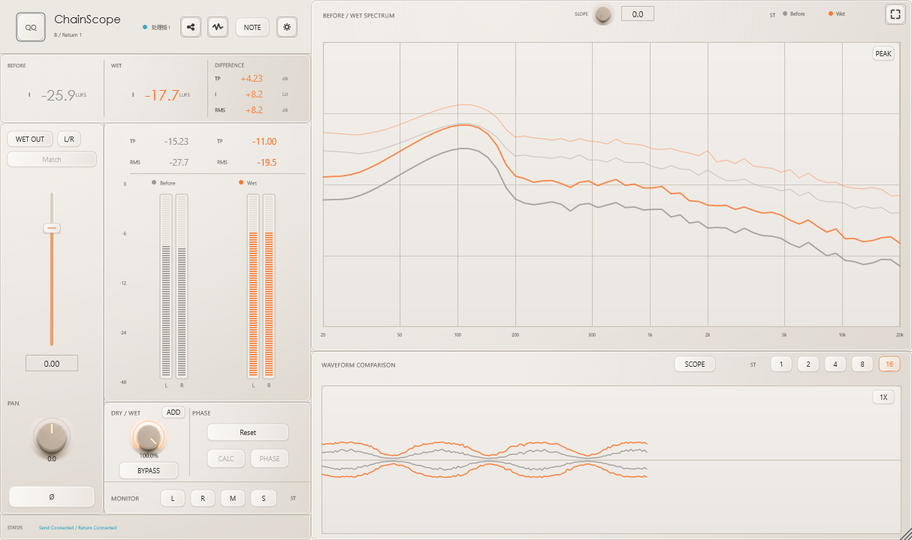
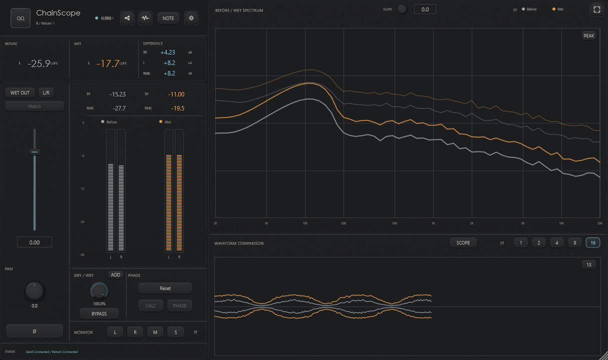

# 插件护士 - QQ ChainScope

**Qing Audio 官方下载与发布页 / Official downloads and releases by Qing Audio**

> **不是单纯的 A/B 按钮，也不是单纯的频谱仪。**
> QQ ChainScope 是一套直接工作在真实 DAW 工程里的“处理链护士”：它帮助你检查处理前后变化、做公平响度比较、给整条链增加 Dry/Wet、校准相位与左右电平、修正残余延迟、记录硬件设置，并把最多四套处理方案放到同一个 Mixboard 里横向比较。
>
> **More than an A/B button or spectrum analyzer.**
> QQ ChainScope is a practical “plug-in nurse” that lives inside a real DAW session: compare before/after behavior, loudness-match fairly, add Dry/Wet to a whole chain, align phase, calibrate L/R balance, rescue residual timing errors, document hardware settings, and compare up to four independent processing choices in one Mixboard.

> **QQ ChainScope 是专有软件，不开源。** 本公开仓库只提供编译后的插件成品、文档、截图和版本说明；源码仓库保持私有。
> **QQ ChainScope is proprietary software and is not open source.** This public repository contains compiled plug-ins, documentation, screenshots, and release information only; the source repository remains private.

## 最新版本 / Latest Release

**QQ ChainScope 1.6.2 · 2026-09-10**

现在有 **Classic、SSL、Light、Dark 四种界面可选**。1.6.2 改进了 SSL 银色推子的外观，并加粗 SSL 字体，让文字更清楚。

Choose from **four UI styles: Classic, SSL, Light and Dark**. Version 1.6.2 refines the silver SSL fader and uses bolder SSL text for easier reading.

- **[下载 1.6.2 / Download 1.6.2](https://github.com/Qing-Audio/Plugin-Nurse-QQ-ChainScope-Release/releases/tag/v1.6.2)**
- [全部历史版本 / All releases](https://github.com/Qing-Audio/Plugin-Nurse-QQ-ChainScope-Release/releases)
- [问题反馈 / Issues](https://github.com/Qing-Audio/Plugin-Nurse-QQ-ChainScope-Release/issues)

## 四种界面 / Four UI styles

在 **B Return 或 C Mixboard** 中，点击右上角 **Settings 齿轮 → UI STYLE**，选择喜欢的风格即可。A Send 使用 Classic 界面。

In **B Return or C Mixboard**, click the **Settings gear at the top right → UI STYLE** and choose a style. A Send uses Classic.

### Classic



### SSL



### Light



### Dark



## 逐版本更新 / Version-by-version changes

上次公开版本为 **1.5.23**。此后的三个实际开发版本如下；1.6.0 和 1.6.1 的改进均包含在本次 1.6.2 中。

The previous public release was **1.5.23**. All three subsequent development versions are listed below; 1.6.2 includes the changes from 1.6.0 and 1.6.1.

### 1.6.0 — Light / Dark — 2026-09-09

中文：B Return 和 C Mixboard 新增 Light、Dark 两种界面，保留 Classic、SSL；设置页和 Note 也使用所选风格。Light / Dark 采用灰色 Before、橙色 After，并改进 Pan 灯环的左右指示。控件位置与声音处理不变。

English: Added Light and Dark to B Return and C Mixboard alongside Classic and SSL, including Settings and Note. Light / Dark use grey Before and orange After, with a clearer left/right Pan indicator. Control positions and audio processing remain unchanged.

### 1.6.1 — 旋钮与字体 / Knobs and typography — 2026-09-09

中文：放大 Light / Dark 的 Pan 和 Dry/Wet 旋钮，统一两种风格的实际旋钮尺寸；缩小 SSL、Light、Dark 的 Spectrum Slope 旋钮，并调整这三种风格的字体。原有控件位置和功能不变。

English: Enlarged Pan and Dry/Wet knobs in Light / Dark and matched their physical sizes. Reduced the Spectrum Slope knob in SSL, Light and Dark, and updated typography in those three styles. Existing control positions and functions remain unchanged.

### 1.6.2 — SSL 推子与清晰文字 / SSL fader and clearer text — 2026-09-10

中文：SSL 推子改为选定参考图中的银色外观，保留推子帽比例；SSL 字体加粗，提高标签、按钮和读数的可读性。手册的界面说明简化为四种风格、切换位置和实际截图。声音处理不变。

English: SSL faders use the selected silver reference appearance while preserving the cap proportions. Bolder SSL text improves labels, buttons and readouts. The manual's UI guide now simply shows the four styles, where to select them and actual screenshots. Audio processing is unchanged.

## 1.5.18 → 1.5.23 历史更新 / Historical changes

起点：公开 README 与最近一次 Release 均已记录至 1.5.18（包括 2026-09-04 Stop HOLD 后续）。以下覆盖随后真实发生的同版本 SSL 开发迭代以及 1.5.19、1.5.20、1.5.21、1.5.22、1.5.23；遗漏版本：无。中间候选未各自单独公开发布，其状态保留为历史事实。

Starting point: both the public README and latest Release had reached 1.5.18, including the September 4 Stop HOLD follow-up. The entries below cover subsequent same-version SSL iterations and versions 1.5.19 through 1.5.23, with no omissions. Intermediate candidates were not separate public releases; their original status is retained as history.

### 1.5.18 SSL 初版 / Initial SSL candidate — 2026-09-08

中文：首次为 Return 增加可选 Classic / SSL 切换，默认仍为 Classic；主界面、Note 与 Settings 使用可切换的外观，选择单独保存供新窗口使用。Send 和当时的 Mixboard 保持 Classic。此阶段仍为同版本 Candidate，不改变音频处理或工程协议。

English: Added the first optional Classic / SSL switch to Return, with Classic remaining the default. Main view, Note and Settings support the skin, and the choice is saved separately for new windows. Send and the then-current Mixboard remain Classic. This was a same-version Candidate with no audio or project-protocol changes.

### 1.5.18 SSL 材质后续 / SSL material follow-up — 2026-09-08

中文：根据实际界面反馈调整输出区材质、推子、Pan / Dry-Wet 旋钮比例、刻度与数值避让，并补齐 Note 的 SSL 外框和纸面。该同版本 R2 仅是历史开发标识；后续正式使用递增版本号。

English: Refined output-panel materials, fader, Pan / Dry-Wet proportions, scale readability and value-label clearance from actual UI feedback, and completed Note's SSL frame and paper. The same-version R2 label is historical only; subsequent iterations use incremented version numbers.

### 1.5.19 — 控制台控件 / Console controls — 2026-09-08

中文：重新打磨银色推子帽、分列刻度、磨砂旋钮与实体按键；QQ 铭牌取消发光。SSL 数值框避让旋钮，刻度与推子帽共用显示映射；Classic、控制操作与音频增益含义不变。历史 Candidate。

English: Refined the silver fader cap, separate scale, matte knobs and physical buttons; removed illumination from the QQ badge. SSL value labels clear the knobs, with one display mapping shared by the fader and ruler. Classic, control interaction and audio-gain meaning remain unchanged. Historical Candidate.

### 1.5.20 — 选定的 SSL 美术 / Approved SSL appearance — 2026-09-08

中文：按选定参考统一洁净中性灰面板、小巧银色推子、平顺黑色旋钮和清晰实体按键，减少粗糙、脏污与多余装饰。Note / Settings 同步材质，保留真实布局与原有读数。历史 Candidate。

English: Unified the selected clean neutral-grey panels, compact silver fader, smooth black knobs and defined physical buttons, reducing rough texture and excess ornament. Note / Settings share the materials while real layout and readings are preserved. Historical Candidate.

### 1.5.21 — Mixboard SSL — 2026-09-09

中文：将 Return 的 SSL 材质应用到 Mixboard 的 COMPARE / MIX，保留 Classic、原布局和短行程推子比例。Settings 增加 UI STYLE；新窗口沿用最后选择，其他已开窗口不强制改变。Return 的 WET OUT / MAIN OUT 入口明确显示为按钮。历史 Candidate。

English: Applied Return's SSL materials to Mixboard COMPARE / MIX, preserving Classic, layout and short-fader proportions. Settings adds UI STYLE; new windows follow the last choice without changing other open windows. Return's WET OUT / MAIN OUT entry is clearly presented as a button. Historical Candidate.

### 1.5.22 — 频谱控件对齐 / Spectrum control alignment — 2026-09-09

中文：在两种皮肤、两种 Mixboard 模式中采用 Return 的控件坐标：Slope 移到顶栏，AVG/PEAK 固定在频谱右上方，MIX 的 EQ Match 控件排在同一行；AMOUNT / SMOOTH 标题不动，来源图例避让控件。EQ Match 的原有显示条件不变。历史 Candidate。

English: Matched Return's control positions in both skins and Mixboard modes: Slope moves to the title row, AVG/PEAK stays at the upper right inside Spectrum, and MIX EQ Match controls share one row. AMOUNT / SMOOTH captions stay in place and source legends clear the controls. Existing EQ Match visibility conditions remain unchanged. Historical Candidate.

### 1.5.23 — 绘图区等高 / Matching plot height — 2026-09-09

中文：Mixboard 的频谱绘图区顶部下移 6 个逻辑像素，与 Return 完全等高，COMPARE / MIX、Classic / SSL 均适用。控件本来已对齐，因此不再移动控件、标题、频谱底边或波形区。本版正式确认为 Stable；双语手册各追加两页 SSL 实际界面与操作说明，原 1.5.18 正文保留。

English: Moved Mixboard's Spectrum plot top down by six logical pixels to match Return's height in COMPARE / MIX and Classic / SSL. Controls were already aligned, so controls, captions, the plot bottom and waveform area stay put. This version is confirmed Stable. Each bilingual manual appends two SSL UI and operation pages while retaining the original v1.5.18 body.

### 先前公开状态 / Previous public status (historical)

**QQ ChainScope 1.5.18** 仍是当前公开版本；`Fixed Zero Reference Latency Rescue` 仍是稳定开发基线。
**2026-09-04：** Release 成品已更新为同版本 Mixboard Waveform/WaveScope Stop HOLD Candidate；QQ Host/Cubase 人工验收仍待完成，本次没有提升稳定基线。
**QQ ChainScope 1.5.18** remains the current public version; `Fixed Zero Reference Latency Rescue` remains the stable development baseline.
**2026-09-04:** Release assets were refreshed with the same-version Mixboard Waveform/WaveScope Stop HOLD Candidate. QQ Host/Cubase acceptance remains pending, and the stable baseline was not promoted.

- **[下载 v1.5.18 / Download v1.5.18](https://github.com/Qing-Audio/Plugin-Nurse-QQ-ChainScope-Release/releases/tag/v1.5.18)**
- **[全部版本 / All releases](https://github.com/Qing-Audio/Plugin-Nurse-QQ-ChainScope-Release/releases)**
- **[Issues / Bugs & Feedback](https://github.com/Qing-Audio/Plugin-Nurse-QQ-ChainScope-Release/issues)**


## 为什么做 QQ ChainScope？ / Why QQ ChainScope?

很多插件都能告诉你“它自己在做什么”，但真实混音里更常见的问题是：**整条处理链到底发生了什么？**

QQ ChainScope 的重点不是实验室式单插件测试，而是让你在真实工程里直接回答这些问题：

1. **处理前后到底改变了多少？** —— Peak、True Peak、播放段平均 RMS、Integrated LUFS、Spectrum、Waveform、WaveScope。
2. **我觉得这个版本更好，是因为更响吗？** —— 用 Match 把 After 的 Integrated LUFS 匹配到 Before。
3. **这个插件没有 Mix，或者我想把整条链并行混合怎么办？** —— ChainScope 给单个插件、插件串或外部硬件链增加时间对齐的 Dry/Wet。
4. **并行以后为什么发空、变薄、低频没了？** —— PHASE 用于 Original 与纯 Wet 之间的相位/时间关系校准。
5. **模拟硬件左右通道不完全一样怎么办？** —— L/R Cal 校准处理链额外引入的左右平均 RMS 失配；1.2.16 起可用 M 校准源建立更干净的双单声道测试条件。
6. **PDC 后仍有稳定的固定错位怎么办？** —— Latency Rescue 在停止播放后直接测量 post-PDC residual，并对剩余固定误差做最后补救。
7. **硬件旋钮、接线、照片和说明总是散落在工程外？** —— Chain Note 把文字和图片直接跟工程一起保存。
8. **我有 LA-2A、33609、FET、SSL 等多个方案，怎么快速横向比较？** —— 一个 Group 最多 4 个 Return，Mixboard 从同一个 Original 出发快速试听和看图。

Many plug-ins can tell you what **they** are doing. In a real mix, the more useful question is often: **what happened across the whole processing chain?** QQ ChainScope is built around that workflow rather than isolated bench testing.

## 三个组件，一套工作流 / Three Components, One Workflow

当前 1.6.2 的 DAW 列表和实际 VST3 bundle 使用以下名称；三个组件必须始终保持同一版本：

| 插件 / Plug-in | 角色 / Role |
|---|---|
| **QQ-A-Send-ChainScope.vst3** | 放在处理链之前，捕获 Original，并创建或选择 Group。 / Place before the chain to capture Original and create/select a Group. |
| **QQ-B-Return-ChainScope.vst3** | 放在处理链之后，负责测量、Dry/Wet、QQ Bypass、PHASE、L/R Cal、Latency Rescue、图表和 Chain Note。 / Place after the chain for measurement, Dry/Wet, QQ Bypass, PHASE, L/R Cal, Latency Rescue, graphs, and Chain Note. |
| **QQ-C-Mixboard-ChainScope.vst3** | 比较 Original 与最多四个 Return 结果；使用时必须放在 FINAL Return 之后。 / Compare Original with up to four Return results; when used, it must be placed after the FINAL Return. |

最简单的 Single Return：

```text
QQ-A-Send-ChainScope -> plug-in / hardware chain -> QQ-B-Return-ChainScope (FINAL)
```

Multi Return：

```text
Send -> Process A -> Return 1 -> Process B -> Return 2 -> Process C -> Return 3 -> Process D -> Return 4 (FINAL) -> Mixboard
```

**重要：Multi Return 不是把 A+B+C+D 的效果累积起来。** 每个非 FINAL Return 会先记录自己这一套处理结果，然后把时间对齐后的 Original 继续交给下一套处理，所以 R1-R4 都是从同一个 Original 出发的独立方案。

**Important:** Multi Return does **not** compare cumulative A+B+C+D processing. Each non-FINAL Return captures its own result and then passes the aligned Original onward, so R1-R4 remain independent choices based on the same source.

<p align="center">
  
</p>

同一个 Group 应放在**同一 Track 的串行 Insert 链**上。一个 Group 支持 1 个 Send、1-4 个 Return，以及 1 个可选 Mixboard。真正物理位置最后的 Return 必须是 **FINAL**；Mixboard 必须放在 FINAL 后面。

Keep one Group on one serial Insert chain in the same Track. A Group supports one Send, one to four Returns, and an optional Mixboard. The physically last participating Return must be **FINAL**, and Mixboard must be placed after FINAL.

## Return：处理前后到底发生了什么？ / Return: What Changed?

<p align="center">
  
</p>

Return 同时提供：

- **Before / After / Difference**：Integrated LUFS 与差值总览。
- **Peak / True Peak**。
- **播放段平均 RMS**：从当前一次 Play 开始累计，到 Stop 停止并保持；下一次 Play 重新开始。
- **Spectrum**：Before / After，Peak / AVG，悬停查看 Delta。
- **Waveform / WaveScope**：1 / 2 / 4 / 8 / 16 拍刷新，并与工程时间对齐。
- **Match**：一次性把 After Integrated LUFS 匹配到 Before，减少“更响所以更好”的误判。
- **Dry / Wet**：对整条处理链做并行混合。
- **QQ Bypass**：在处理结果和时间对齐后的 Original 之间切换；不是 DAW 的 Deactivate。
- **Monitor**：ST / L / R / M / S。

## L/R Cal 与 M 校准源 / L/R Cal and the M Calibration Source

模拟硬件或某些处理链左右通道可能存在固定电平偏差。L/R Cal 的目标不是强制让左右一样大，而是只修正**处理链额外引入的左右平均 RMS 失配**，保留原始 Stereo 本身的左右关系。

普通 Stereo 素材的左右频谱并不相同，因此即使一个完全对称的 EQ 对 L/R 做同样处理，也可能让左右 RMS 产生不同变化。为了让硬件 L/R 校准更准确，1.2.16 起在 **L/R 模式**中加入了小型 **M** 校准源：

- M ON 时，Send 在处理链之前生成 `Mid = (L + R) / 2`，再复制为双单声道 `L = Mid, R = Mid`。
- Before 的 Meter、TP、RMS、LUFS、Spectrum、Waveform、WaveScope 都以这个双单声道 Mid 为参考。
- After 仍然是处理链真实的 L/R 输出。
- 成功 Cal 后，M 会自动关闭并恢复正常 Stereo。
- M 是**校准工具**，不是 Monitor 区域里的 Mid 监听按钮。

<p align="center">
  
</p>

## PHASE：先校准纯 Wet，再决定 Dry/Wet / PHASE: Calibrate Pure Wet First

PHASE CALC 基于 **Original / Dry 与纯 Wet** 的关系进行测量，发生在 Dry/Wet 混合之前。因此 Dry/Wet 设为 100%、50% 或 20% 都不会改变 PHASE CALC 的测量逻辑。

推荐流程：

```text
播放素材 -> Stop -> CALC -> PHASE ON/OFF A/B
```

点击 CALC 后，当前播放段的 Meter / LUFS / RMS 显示会被清空，这是正常行为；模型已经计算完成，新一次播放会重新开始分析。

PHASE CALC is based on the relationship between the aligned Original/Dry and the **pure raw Wet** before Dry/Wet mixing. The Dry/Wet knob therefore does not change the calibration measurement.

## Latency Rescue：PDC 后仍有固定残差时 / Latency Rescue After PDC

**PDC = Plugin Delay Compensation。** 插件或硬件回路让声音晚到时，DAW 会根据插件上报的延迟自动对齐其它路径。大多数工程只需要 PDC；Latency Rescue 只处理 PDC 工作后仍然存在的**稳定固定残差**。

如果 Before/Dry 与 Wet 在 PDC 后仍无法重合，并行 Dry/Wet 出现梳状感、瞬态发虚或相位感，可以这样使用：

```text
播放有代表性的素材
-> Stop
-> 打开 Return Settings
-> MEASURE & APPLY
-> 用 COMP ON/OFF 试听
```

- **Reference**：从 1.5.18 起固定为 `0 smp / 0.000 ms`，不再需要 `SET REFERENCE`。
- **Current**：本次测得的 post-PDC 固定偏移。
- **Residual**：需要补偿的固定偏移；1.5.18 中与 Current 相同。
- **COMP ON/OFF**：只切换补偿试听，不会删除测量。

不要对混响、Delay、调制或其它本来就随时间变化的效果使用 Latency Rescue；它们的延迟不是可由固定样本数补偿的整体偏移。

**PDC = Plugin Delay Compensation.** The DAW aligns paths using reported plug-in delay. Most sessions need only PDC; Latency Rescue is for a stable fixed residual that remains after PDC.

Play representative material, stop, open Return Settings, click **MEASURE & APPLY**, then audition **COMP ON/OFF**. In v1.5.18 Reference is fixed at zero; Current and Residual show the measured post-PDC bulk offset. Do not use Latency Rescue for reverb, delay, modulation, or other intentionally time-varying effects.

## Mixboard：同一个 Original，最多四套独立方案 / One Original, Up to Four Choices

Mixboard 用于真正的横向比较，而不是把四条曲线简单堆在一起：

- 点击 **ORIGINAL**：试听未经当前 Return 方案处理的 Original。
- 点击某个 Return 名称：试听那一套独立处理结果。
- 一次只听一套结果；切换使用短平滑过渡。
- **VIS = Visibility**：只控制曲线显示/隐藏，不改变声音。
- Spectrum / Waveform / WaveScope 与统一对齐后的 Original + R1-R4 数据源一致。
- Monitor 提供 ST / L / R / M / S，直接改变 Mixboard 最终监听输出。

<p align="center">
  
</p>

## Chain Note：把硬件和处理链资料留在工程里 / Keep the Chain Documentation Inside the Session

Chain Note 支持文字、中文/Unicode、图片、硬件照片、接线说明与参数记录，并随 DAW 工程保存。适合记录：

- 模拟硬件旋钮位置；
- Patch / External FX 接线；
- 插件参数与处理思路；
- 需要以后复现的特殊处理链；
- A/B 结论与工程备注。

<p align="center">
  
</p>

## FULL / ECO 与性能 / Analysis Performance

FULL / ECO **只决定显示分析什么时候工作，不改变声音 DSP**。

- **Return FULL**：DAW 实时工作时持续维护显示分析。
- **Return ECO**：编辑器需要时才运行昂贵的显示分析。
- **Mixboard FULL**：COMPARE 与 MIX 在同一轮播放中各自维护独立 Spectrum、Waveform/WaveScope 与 Stop/HOLD 显示库；切换模式不会清空或重播。
- **Mixboard ECO**：只维护当前模式，以降低显示分析开销。
- **Offline Render**：显示分析自动关闭，声音 DSP 正常工作。
- **Transport Stop Hold**：Stop 后保持最后结果，不被宿主停止状态下的静音 callback 冲掉。

FULL/ECO controls display analysis only and does not alter audio DSP. In Mixboard FULL, COMPARE and MIX maintain independent Spectrum and Waveform/WaveScope display/HOLD banks during the same pass; switching modes does not clear or replay them. ECO maintains only the selected mode. Offline render disables display analysis while audio DSP remains active, and Stop holds the last completed results.

## 1.5.18 更新 / What Changed in 1.5.18

### 2026-09-04 同版本后续 / Same-Version Follow-up — Candidate

- 中文：修复 QQ Host 中 DAW Stop 后 Mixboard Waveform/WaveScope 可能消失的问题。UI 现在拥有独立 COMPARE/MIX HOLD bank；停止后按稳定 Return UUID 保留仍存在的来源，删除 Return 导致槽位前移时不会清掉其它来源，新插入/替换 Return、换 Group、硬 reset 与下一次 Play 不会继承旧波形。
- English: Fixed Mixboard Waveform/WaveScope disappearing after DAW Stop inside QQ Host. The UI now owns independent COMPARE/MIX HOLD banks; surviving Returns are preserved by stable UUID across slot compaction, while a new/replaced Return, Group change, hard reset, or next Play cannot inherit stale waveform data.
- 中文：音频 DSP、PDC、Spectrum、EQ Match、PHASE、参数、默认值、Project State `61` 和 Runtime `v25` 均未改变。
- English: Audio DSP, PDC, Spectrum, EQ Match, PHASE, parameters, defaults, Project State `61`, and Runtime `v25` are unchanged.
- 中文：Windows 默认 Release 构建、三个 1.5.18 版本、Steinberg validator `0/0/0` 与 HOLD 模型 `13/13` 已通过；人工宿主验收尚未完成，因此本修订仍为 Candidate。
- English: The default Windows Release build, all three v1.5.18 version checks, Steinberg validator `0/0/0`, and the `13/13` HOLD model passed. Manual host acceptance is still pending, so this revision remains Candidate.

### 2026-08-31 稳定基线 / Stable Baseline

1.5.18 简化并修正 Latency Rescue：Reference 永久固定为 0，移除 `SET REFERENCE`；停止播放后点击 `MEASURE & APPLY` 即可建立本次测量域，`Current = Residual =` 测得的 post-PDC 固定偏移。已经完成测量的旧工程会保留有符号 Residual 并无声迁移；只有旧 Reference、没有完成测量的状态会变为 `NO MEASUREMENT`。

Version 1.5.18 simplifies and corrects Latency Rescue: Reference is permanently fixed at zero, `SET REFERENCE` is removed, and `MEASURE & APPLY` after Stop establishes the measurement domain with `Current = Residual =` the measured post-PDC fixed offset. Completed legacy measurements preserve signed Residual and migrate silently; Reference-only legacy state becomes `NO MEASUREMENT`.

兼容性与验证 / Compatibility and validation:

- Windows 10/11 x64 VST3；macOS 11+ Apple Silicon VST3、Intel x86_64 VST3、Universal 2 AU。
- Windows 三个 VST3 已完成 Release 构建、版本/哈希核对和 Steinberg validator；macOS 三类生成物已核对架构、版本、CRC，AU 完成签名检查与 `auval`。
- 三个组件必须一起升级，不能混用版本。
- macOS 生成物为 ad-hoc 签名，未经过 Apple Developer ID 公证。

- Windows 10/11 x64 VST3; macOS 11+ Apple Silicon VST3, Intel x86_64 VST3, and Universal 2 AU.
- All three Windows VST3 bundles passed Release build, version/hash checks, and Steinberg validation. The macOS packages passed architecture, version, and CRC checks; AU also passed signature verification and `auval`.
- Upgrade all three components together; do not mix versions.
- macOS builds are ad-hoc signed and are not notarized with an Apple Developer ID.

## 1.2.17 更新 / What Changed in 1.2.17

1.2.17 是一个**DAW 可读性更新**：三个 VST3 的 DAW 显示名与实际 bundle 名都改为更容易在窄插件列表里区分的 A/B/C 前缀：

```text
QQ A Send ChainScope.vst3
QQ B Return ChainScope.vst3
QQ C Mixboard ChainScope.vst3
```

插件角色、DSP、Group/Runtime、参数、工程状态以及现有功能保持不变。

**升级注意：** 旧版文件名不会自动消失。升级到 1.2.17 时应先删除：

```text
QQ ChainScope Send.vst3
QQ ChainScope Return.vst3
QQ ChainScope Mixboard.vst3
```

再放入新版三个 bundle，避免 DAW 同时扫描到新旧两套文件。

<p align="center">
  
</p>

### 近期 1.2.x 重要更新 / Recent 1.2.x Highlights

- **1.2.16 — Mid Calibration Source**：L/R 模式新增 M 双单声道校准源；成功 Cal 后自动恢复 Stereo。
- **1.2.15 — Transport Stop Hold**：在 REAPER 等宿主 Stop 后仍继续 callback 的情况下，图表保持最后一帧，播放段统计停止累计。
- **1.2.14 — UTF-8 Safe Runtime Names**：Group / Return 名称支持更可靠的中文、日文、韩文等多字节字符。
- **1.2.13 — Auto Final Until Manual**：新 Return 自动成为 FINAL，第一次手动选择 FINAL 后进入手动锁定。
- **1.2.12 — Manual FINAL Return**：Multi Return 的唯一 FINAL 规则与统一输出。
- **1.2.7 — Shared Aligned Spectrum**：Return 与 Mixboard 共用统一对齐后的分析源。
- **1.2.6 — Unified Aligned Sources**：Original + R1-R4 统一到同一时间轴后再决定播放与分析哪一路。

## 1.2.18 → 1.5.18 完整逐版本记录 / Complete Version-by-Version Record

公开 README 和上一公开 Release 的起点均为 `1.2.17`；本次终点为 `1.5.18`。以下直接记录区间内全部 39 个真实开发版本，包括后来被替代的 Candidate。
Both the public README and the previous public Release ended at `1.2.17`; this update ends at `1.5.18`. The 39 real versions in that interval are listed directly below, including candidates later superseded.

| 版本 / Version | 日期与状态 / Date and status | 中文变化 / English changes |
|---|---|---|
| **1.2.18** | 2026-08 · Candidate，后来提升为 Stable / later promoted Stable | 中文：为每个 Return/Mixboard 编辑器加入窗口恢复保护，防止 Cubase 的陈旧 wrapper 矩形污染缩放；DSP、路由和 state 不变。<br>English: Added per-editor window-restore guards so stale Cubase wrapper rectangles cannot corrupt scale; DSP, routing, and state stayed unchanged. |
| **1.3.0** | 2026-08 · Candidate | 中文：新增全局 Spectrum Slope、Linear-Phase EQ Match、Amount/Smooth 的前置开发线，以及 10/20/40/80 ms 质量选项。<br>English: Introduced global Spectrum Slope, the Linear-Phase EQ Match development line, and 10/20/40/80 ms quality choices. |
| **1.3.1** | 2026-08-18 · Stable | 中文：让 PHASE CAL 与 EQ Match CAL 各自保留资料，Dry/Wet 不再清除 Match；QQ Bypass 移到 Monitor 之前。<br>English: Made PHASE and EQ Match calibration data independent, stopped Dry/Wet from clearing Match, and moved QQ Bypass before Monitor. |
| **1.3.2** | 2026-08 · 开发版本 / Development | 中文：新增 Standalone None，调整 Delta 布局，并把三个实际 bundle 改为连字符命名；升级必须删除旧三件套。<br>English: Added Standalone None, refined Delta layout, and adopted hyphenated physical bundle names; old three-bundle sets must be removed on upgrade. |
| **1.3.3** | 2026-08 · 开发版本 / Development | 中文：提高 Match 精度，修复 Bypass 启动 Wet 突发，并让脱离 Send 的 Standalone Return 保留已提交校准模型。<br>English: Improved Match precision, fixed a bypass-startup Wet burst, and retained committed calibration models when a Return detaches into Standalone. |
| **1.3.4** | 2026-08 · 开发版本 / Development | 中文：低频 Match 改用 16384 点高精度分析，恢复并明确 PHASE/Polarity 行为与保存状态。<br>English: Moved LF Match to 16384-point high-precision analysis and restored/clarified PHASE and Polarity behavior and persistence. |
| **1.3.5** | 2026-08 · 开发版本 / Development | 中文：Return AVG 与 Mixboard 共用高精度分析结果，PHASE 极性元数据升级为 QCP9。<br>English: Unified high-precision Return AVG and Mixboard data and advanced PHASE polarity metadata to QCP9. |
| **1.3.6** | 2026-08 · 开发版本 / Development | 中文：新增连续 EQ Match Amount 与可见匹配曲线。<br>English: Added continuous EQ Match Amount and a visible match curve. |
| **1.3.7** | 2026-08 · 开发版本 / Development | 中文：EQ Match 改用 16384 点 FFT 频带功率，并移除固定 -100 dB 分析地板。<br>English: Changed EQ Match to 16384-point FFT band power and removed the fixed -100 dB analysis floor. |
| **1.3.8** | 2026-08 · 开发版本 / Development | 中文：加入完整传递曲线、Smooth、QEM2，并固定 AVG/PEAK 槽位语义。<br>English: Added full-transfer correction, Smooth, QEM2 data, and fixed AVG/PEAK slot semantics. |
| **1.3.9** | 2026-08 · 开发版本 / Development | 中文：调整 UI 默认值；加入双卷积器 IR 预热与交叉淡化，修复快速拖动卡顿。<br>English: Refined UI defaults, added dual-convolver IR warm-up/crossfade, and fixed rapid-drag stutter. |
| **1.3.10** | 2026-08 · 开发版本 / Development | 中文：相关控制行下移 8 px，完成界面对齐；DSP 与兼容性不变。<br>English: Moved the relevant control row by 8 px for final alignment; DSP and compatibility were unchanged. |
| **1.4.0** | 2026-08 · Stable | 中文：Mixboard 新增 ST/MONO/L/R/SIDES/SIP、Monitor Filter、斜率和频段试听，并以平滑交叉淡化切换。<br>English: Added the full Mixboard Monitor system with ST/MONO/L/R/SIDES/SIP, Monitor Filter, slopes, band audition, and smooth transitions. |
| **1.4.1** | 2026-08 · 开发版本 / Development | 中文：改进来源/眼睛状态、SIP 默认和紧凑滤波界面，并为 L/R 单声道试听加入监听补偿。<br>English: Refined source/eye state, SIP defaults, compact filter UI, and monitor-only compensation for L/R mono audition. |
| **1.4.2** | 2026-08 · 开发版本 / Development | 中文：统一 LOW CUT/Band Pass/HIGH CUT 的试听语义，调整 Slope 行并修正 SIDES 补偿。<br>English: Corrected LOW CUT/Band Pass/HIGH CUT audition semantics, refined the Slope row, and fixed SIDES compensation. |
| **1.4.3** | 2026-08 · Stable | 中文：SUB/BASS/LOW MID/MID/HIGH 总会载入边界并回到 Band Pass，消除旧 Cut/Bypass 模式残留。<br>English: Named band buttons always load their boundaries and return to Band Pass, eliminating stale Cut/Bypass modes. |
| **1.4.4** | 2026-08 · 开发版本 / Development | 中文：Return 分离 WET OUT 与 MAIN OUT 测量域；PHASE 保持 Wet-only，EQ Match 保持 Main-only。<br>English: Split Return into WET OUT and MAIN OUT measurement domains; PHASE remains Wet-only and EQ Match Main-only. |
| **1.4.5** | 2026-08 · 开发版本 / Development | 中文：WET/MAIN 获得一致的单输出与 L/R 控制，新增 ADD（Add Wet）和 50 ms 平滑切换。<br>English: Added aligned WET/MAIN single-output and L/R controls plus ADD (Add Wet) with a 50 ms smooth switch. |
| **1.4.6** | 2026-08 · 开发版本 / Development | 中文：修复 WET/MAIN L/R→单输出往返；ADD 在 Standalone/None 中禁用并在重连 Group 后恢复。<br>English: Fixed WET/MAIN L/R-to-single-output roundtrips; ADD disables in Standalone/None and restores after Group reconnect. |
| **1.4.7** | 2026-08 · Stable | 中文：L/R 差异可跨多次模式切换保存，单输出调节会整体平移保存的 L/R 对。<br>English: Preserved L/R difference across repeated mode switches, with single-output edits translating the retained pair. |
| **1.5.0** | 2026-08 · 开发版本 / Development | 中文：Mixboard 新增 COMPARE/MIX，可按比例混合对齐后的 Original 与 R1-R4 final MAIN，并加入 Mix Main、MIX EQ Match 和分析视图。<br>English: Added COMPARE/MIX, proportional summing of aligned Original and R1-R4 final MAIN, Mix Main, MIX EQ Match, and analysis views. |
| **1.5.1** | 2026-08 · 开发版本 / Development | 中文：修复 Runtime 租约造成的 MIX 静音和空 Meter/Spectrum/Waveform，并整理来源控制。<br>English: Fixed Runtime-lease MIX silence and empty analysis displays, and compacted source controls. |
| **1.5.2** | 2026-08 · 开发版本 / Development | 中文：COMPARE/MIX 改为连续 raised-cosine 交叉淡化；MIX 明确不使用 Monitor Filter。<br>English: Replaced suspend/resume with a continuous raised-cosine COMPARE/MIX crossfade; MIX explicitly omits Monitor Filter. |
| **1.5.3** | 2026-08 · Stable | 中文：修复 MIX 百分比精确输入和定时器覆盖；Alt 均分按当前 Included 来源计算，并优化紧凑 Pan。<br>English: Fixed MIX numeric entry and timer overwrite, made Alt equal share follow Included sources, and refined compact Pan. |
| **1.5.4** | 2026-08 · 开发版本 / Development | 中文：MONO/L/R/SIDES 与滤波模式支持重复点击取消；移除独立 RESET，Slope 改为紧凑数字选择器。<br>English: Made monitor/filter modes self-cancelling, removed separate RESET, and changed Slope to a compact numeric selector. |
| **1.5.5** | 2026-08 · 开发版本 / Development | 中文：Return/Mixboard Monitor 与 SIP 使用 20 ms 平滑矩阵，EQ Match Quality 增至 10/20/40/80 ms。<br>English: Added 20 ms smoothed Return/Mixboard Monitor and SIP matrices and 10/20/40/80 ms EQ Match Quality. |
| **1.5.6** | 2026-08 · 开发版本 / Development | 中文：修复多 Return Final audition 的来源 Monitor metadata 硬切换，每个来源独立平滑。<br>English: Fixed hard source-Monitor metadata switching in multi-Return Final audition with per-source smoothing. |
| **1.5.7** | 2026-08 · 开发版本 / Development | 中文：有 MIX EQ Match 模型时持续预热隐藏 MIX、卷积和对齐历史，消除返回 MIX 的冷启动爆音。<br>English: Kept hidden MIX, convolution, and alignment history warm when a MIX EQ Match model exists, eliminating cold-start pops. |
| **1.5.8** | 2026-08 · 开发版本 / Development | 中文：恢复完整 EQ Match 传递校正，移除仅保留形状的宽带均值归一化；不加入实时 LUFS 自动增益。<br>English: Restored full EQ Match transfer correction, removed shape-only broadband normalization, and added no realtime LUFS autogain. |
| **1.5.9** | 2026-08 · 开发版本 / Development | 中文：区分真实 DAW Play/Stop 与单回调分析推进，静态位置或短暂缺失 PositionInfo 不再误隐藏 MIX 曲线。<br>English: Split real DAW Play/Stop from per-callback analysis advancement so static positions or transient missing PositionInfo no longer hide MIX curves. |
| **1.5.10** | 2026-08-22 · Stable | 中文：MIX Spectrum 只分析有效 processFrames，并直接分析已对齐的立体声 Before/After，避免陈旧尾部和双重 Monitor 转换。<br>English: Limited MIX Spectrum to valid processFrames and analyzed aligned stereo Before/After directly, avoiding stale tails and double Monitor conversion. |
| **1.5.11** | 2026-08-23 · Stable | 中文：ST 频谱改为 L/R 各自计算功率后逐频带平均，纯 Side 不再因 `(L+R)/2` 抵消。<br>English: Corrected ST Spectrum to average independent L/R band power so pure Side no longer disappears through `(L+R)/2` cancellation. |
| **1.5.12** | 2026-08-23 · Candidate，已被 1.5.13 取代 / superseded | 中文：Return/Mixboard 保存对齐的立体声 L/R 分析历史，Stop 后可切换通道与频段视图而无需重播。<br>English: Retained aligned stereo L/R analysis history so channel and band views can be switched after Stop without replay. |
| **1.5.13** | 2026-08-23 · Stable | 中文：保留 1.5.12 功能并降低分析开销：一次 L/R 捕获派生全部视图，AVG/EQ FFT 减少，Waveform 按 UI 需求生成，ECO 跳过隐藏开销。<br>English: Preserved v1.5.12 while reducing analysis cost through one L/R capture for all views, fewer AVG/EQ FFTs, on-demand Waveform snapshots, and ECO hidden-work skips. |
| **1.5.14** | 2026-08-24 · Stable | 中文：修复真实宿主时间线被旧回退数据替换；三个 Windows target 在 CMake 正式加入 NOMINMAX，避免 MSVC min/max 宏干扰。<br>English: Fixed stale fallback data replacing a real host timeline and formally added NOMINMAX to the three Windows CMake targets. |
| **1.5.15** | 2026-08-25 · Stable | 中文：FULL 下 COMPARE/MIX 同时维护独立分析与显示/HOLD bank；修复 Stop 后 VIS/Delta 更新，并统一 MIX Slope 布局。<br>English: Added independent simultaneous COMPARE/MIX analysis and display/HOLD banks in FULL, fixed stopped VIS/Delta updates, and aligned MIX Slope layout. |
| **1.5.16** | 2026-08-25 · Stable | 中文：统一 MIX 与 COMPARE Spectrum 的固定绘图区几何，不改变 Spectrum 或音频算法。<br>English: Unified fixed MIX and COMPARE Spectrum plot geometry without changing Spectrum or audio algorithms. |
| **1.5.17** | 2026-08-26 · Stable | 中文：加入工程恢复保护，防止重开工程时宿主临时格式清除已完成的 Latency Rescue；真实后续格式/Group 变化仍安全失效。<br>English: Added project-restore protection so provisional host formats cannot clear completed Latency Rescue; genuine later format/Group changes still invalidate safely. |
| **1.5.18** | 2026-08-31 · 当前 Stable / Current Stable | 中文：Latency Rescue 的 Reference 固定为 0，移除 SET REFERENCE；停止播放后 MEASURE & APPLY 直接测量 post-PDC offset，并保存 Current=Residual。旧工程保留有符号 Residual 并无声迁移。<br>English: Fixed Latency Rescue Reference at 0, removed SET REFERENCE, and made MEASURE & APPLY directly store the measured post-PDC offset as Current=Residual after Stop. Legacy signed Residual migrates silently. |
| **1.5.18 同版本后续 / Same-version follow-up** | 2026-09-04 · Candidate | 中文：修复 QQ Host 内 Mixboard Waveform/WaveScope 的 DAW Stop HOLD，并按稳定 UUID 保护删除、槽位前移和替换 Return 时的显示身份；DSP、PDC 与状态协议不变。<br>English: Fixed Mixboard Waveform/WaveScope DAW-Stop HOLD inside QQ Host, preserving display identity by stable UUID across Return deletion, compaction, and replacement; DSP, PDC, and state protocols are unchanged. |

覆盖核对 / Coverage check: `1.2.18`, `1.3.0–1.3.10`, `1.4.0–1.4.7`, `1.5.0–1.5.18`; 遗漏版本：**无** / omitted versions: **none**.

## 下载 / Downloads

**[QQ ChainScope 1.6.2 Release](https://github.com/Qing-Audio/Plugin-Nurse-QQ-ChainScope-Release/releases/tag/v1.6.2)**

- [Windows x64 VST3](https://github.com/Qing-Audio/Plugin-Nurse-QQ-ChainScope-Release/releases/download/v1.6.2/QQ-ChainScope-1.6.2-Windows-x64-VST3.zip)
- [macOS Apple Silicon VST3](https://github.com/Qing-Audio/Plugin-Nurse-QQ-ChainScope-Release/releases/download/v1.6.2/QQ-ChainScope-1.6.2-macOS-Apple-Silicon-VST3.zip)
- [macOS Intel x86_64 VST3](https://github.com/Qing-Audio/Plugin-Nurse-QQ-ChainScope-Release/releases/download/v1.6.2/QQ-ChainScope-1.6.2-macOS-Intel-x86_64-VST3.zip)
- [macOS Universal 2 AU](https://github.com/Qing-Audio/Plugin-Nurse-QQ-ChainScope-Release/releases/download/v1.6.2/QQ-ChainScope-1.6.2-macOS-Universal-2-AU.zip)
- [中文安装说明](https://github.com/Qing-Audio/Plugin-Nurse-QQ-ChainScope-Release/releases/download/v1.6.2/QQ-ChainScope-1.6.2-Installation-Guide-Chinese.txt)
- [English installation guide](https://github.com/Qing-Audio/Plugin-Nurse-QQ-ChainScope-Release/releases/download/v1.6.2/QQ-ChainScope-1.6.2-Installation-Guide-English.txt)
- [中文用户手册](https://github.com/Qing-Audio/Plugin-Nurse-QQ-ChainScope-Release/releases/download/v1.6.2/QQ-ChainScope-User-Manual-Chinese-v1.6.2.pdf)
- [English user manual](https://github.com/Qing-Audio/Plugin-Nurse-QQ-ChainScope-Release/releases/download/v1.6.2/QQ-ChainScope-User-Manual-English-v1.6.2.pdf)

三个插件必须同版本、一起升级。Apple Silicon / Intel VST3 只装一个架构包；Rosetta 宿主选择 Intel；AU 是独立格式。GitHub 自动附带的 Source code 下载仅为本公开文档仓库，不包含插件源码。

Keep all three plugins on the same version. Install only one VST3 architecture; use Intel for a Rosetta host. AU is a separate format. GitHub's automatic Source code downloads contain this public documentation repository only, not the plugin source.

## 安装 / Install

### Windows x64 VST3

1. 完全退出 DAW。
2. 删除系统 VST3 目录中旧版或旧命名的三个 ChainScope bundle；不要保留重复版本。
3. 解压 Windows 包。
4. 将三个 1.6.2 `.vst3` bundle 放到：

```text
C:\Program Files\Common Files\VST3
```

5. 重新打开 DAW，必要时重新扫描插件。

### macOS VST3

- Apple Silicon 原生宿主：安装 Apple Silicon VST3 包。
- Intel Mac 或 Rosetta 下的 Intel 宿主：安装 Intel VST3 包。
- **不要同时安装两套 VST3 架构包。**

用户目录 / Per-user folder:

```text
~/Library/Audio/Plug-Ins/VST3
```

### macOS Audio Unit

Universal 2 AU 包包含 arm64 + x86_64：

```text
~/Library/Audio/Plug-Ins/Components
```

macOS 构建经过临时签名与构建验证，但**没有 Apple Developer ID 公证**。如果系统阻止加载，请只在确认文件来自本仓库 Release 后，按照随包安装说明处理 quarantine 属性。

The macOS builds are ad-hoc signed and build-validated, but **not notarized with an Apple Developer ID**. If macOS blocks them, follow the included installation guide only after confirming the files came from this repository's Release.

## 系统要求 / Requirements

| 平台 / Platform | 格式与架构 / Format and Architecture |
|---|---|
| Windows | 64-bit VST3 / x64 |
| macOS Apple Silicon | VST3 / native arm64 |
| macOS Intel | VST3 / native x86_64 |
| macOS AU | Universal 2 / arm64 + x86_64 |
| macOS 最低目标系统 / Deployment target | macOS 11 or later |

## 已知限制与兼容性 / Known Limitations and Compatibility

- macOS 文件经过 ad-hoc 签名，但没有 Apple Developer ID 公证；只应从本仓库正式 Release 下载，并按随包说明处理 quarantine。
- Apple Silicon 与 Intel VST3 二选一；不要同时安装两个架构包。Universal 2 AU 可以单独安装。
- 三个 ChainScope 组件必须同版本、一起替换；升级前关闭 DAW 并删除旧 bundle，必要时重新扫描。
- 不同 DAW/系统版本的扫描、窗口恢复和实时回调行为可能不同；如遇问题请通过本仓库 Issues 提供可复现信息。

- macOS files are ad-hoc signed but not Apple Developer ID notarized. Download only from this repository's official Release and follow the included quarantine instructions.
- Install either the Apple Silicon or Intel VST3 package, not both. The Universal 2 AU can be installed separately.
- Keep all three ChainScope components on the same version. Quit the DAW, remove old bundles, replace the full set, and rescan if required.
- Plug-in scanning, window restoration, and realtime callback behavior can vary by DAW and OS version; report reproducible issues through this repository.

## 用户手册 / User Manuals

1.6.2 提供中文和英文手册。界面说明只介绍四种可选风格、切换位置，并配上实际截图；原有功能和操作说明保留。手册下载见上方“下载”。

Version 1.6.2 includes Chinese and English manuals. The UI guide shows the four styles, where to choose them and actual screenshots; existing feature and operating instructions are retained. Find both manuals under Downloads above.

SSL 是本项目的皮肤名称，不表示官方合作、授权或背书。/ SSL is a skin name, not an affiliation, licensing or endorsement claim.

## FINAL 规则 / FINAL Rules

- 同一个 Group 正常情况下只有一个 FINAL。
- 物理位置最后的参与 Return 必须是 FINAL。
- Mixboard 必须放在 FINAL 后面。
- R1-R4 是稳定身份/颜色，不代表物理 Insert 顺序。
- 新建 R2/R3/R4 时，系统在自动阶段让最新 Return 成为 FINAL；第一次手动点 FINAL 后进入 Manual Final Lock。
- Deactivate FINAL 不会转移身份；真正删除该 Return 才触发 fallback。

<p align="center">
  
</p>

## 问题与反馈 / Bugs & Feedback

请使用本仓库的 **[Issues](https://github.com/Qing-Audio/Plugin-Nurse-QQ-ChainScope-Release/issues)** 提交可复现问题，并尽量附上：

- 操作系统与版本；
- DAW 与版本；
- VST3 / AU；
- x64 / arm64；
- ChainScope 版本；
- Single Return / Multi Return；
- 实际 Insert 顺序；
- 复现步骤；
- 截图、录屏或工程片段（如果方便）。

For reproducible bug reports, include OS, DAW/version, plug-in format/architecture, ChainScope version, Single/Multi Return topology, actual insert order, reproduction steps, and screenshots/video when possible.

## 许可与使用 / License & Usage

QQ ChainScope 为 Qing Audio 的专有软件，不开源。公开下载仅包含编译后的插件成品与文档，不包含源码。
QQ ChainScope is proprietary Qing Audio software and is not open source. Public downloads contain compiled plug-ins and documentation only, with no source code.

---

**Qing Audio · QQ ChainScope · “插件护士 / Plug-in Nurse”**
